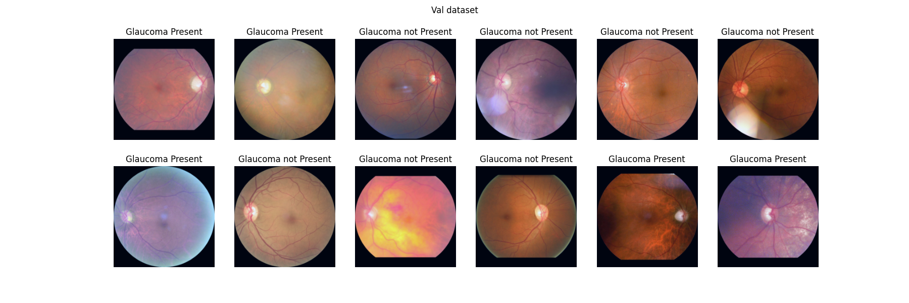
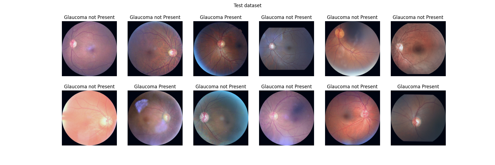
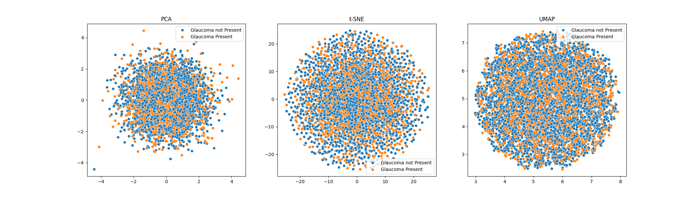

# Hierarchical Variational Autoencoder 

This repository contains my solutions to Project 2 from Statistical Data Analysis 2 Course at University of Warsaw.

Data-set used for this project can be found [here](https://www.kaggle.com/datasets/sabari50312/fundus-pytorch).

## Visualization of normalized datasets

Trainig dataset visualiztion after normalization, standarization and resizing of images

Test dataset visualiztion after normalization, standarization and resizing of images

Validation dataset visualiztion after normalization, standarization and resizing of images

## Visualization of dimensionality reduction

## Appendix: Example convolutions 

A set of activations from convolution filters. Not necessarily ones used in the actual model.

![example convolutions]
