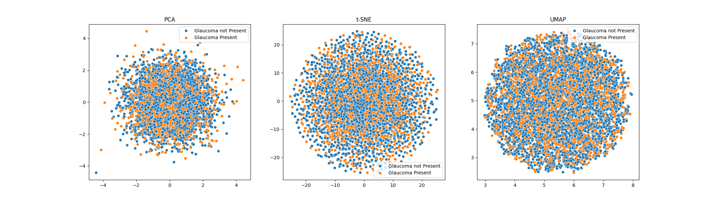

# Hierarchical Variational Autoencoder 

This repository contains my solutions to Project 2 from Statistical Data Analysis 2 Course at University of Warsaw.

Data-set used for this project can be found [here](https://www.kaggle.com/datasets/sabari50312/fundus-pytorch).

